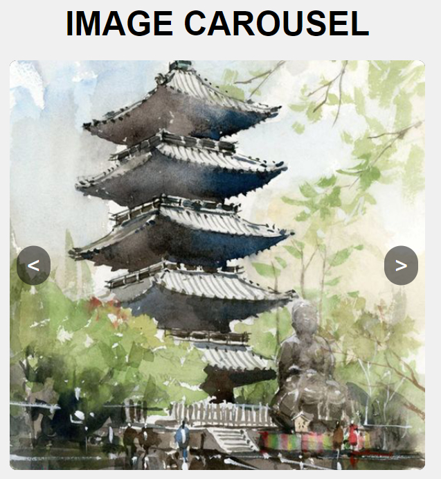

# Carousel Creation Project

Creating a carousel was an excellent exercise for honing my JavaScript skills. Although the carousel is fully functional, I encountered some challenges with the image transitions. I'm currently working on adding a sliding effect whenever the button to change the image is clicked. This has proven to be quite a headache, as the image elements tend to move out of their intended positions when attempting to implement this effect.

Despite these difficulties, I am committed to mastering this feature and ensuring a smooth and visually appealing transition for the carousel images.

Below is an image showcasing the current state of my carousel project:

