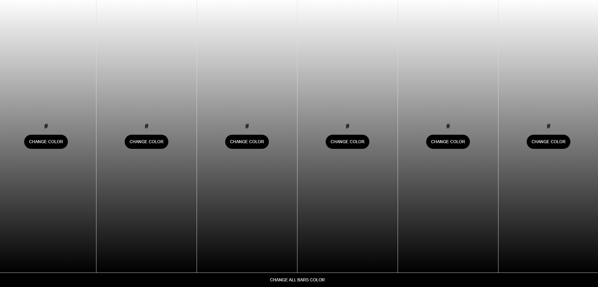
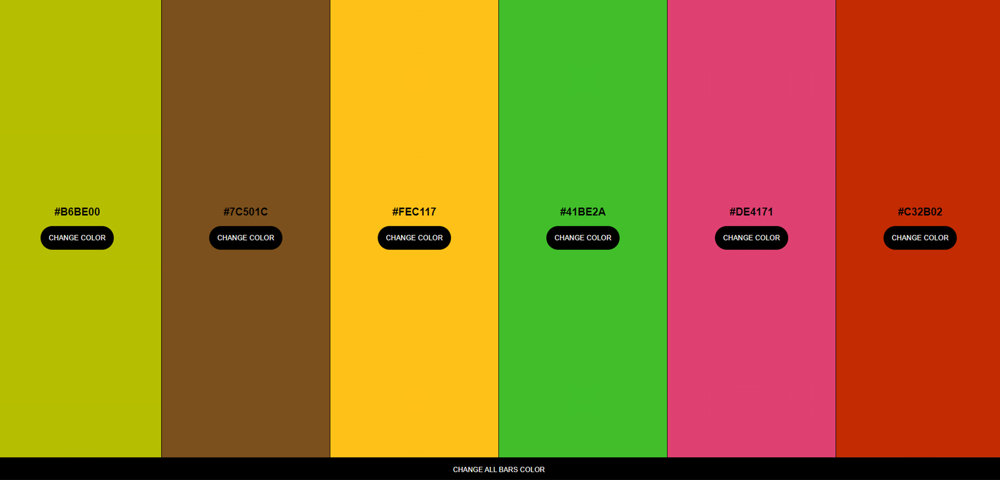

# Random Color Generator App

This exercise involved creating an app that generates random colors and displays their hexadecimal references. I designed six vertical bars, each with a unique color and a button to change the color of that specific bar randomly. At the bottom of the page, there is a button that spans the full width of the page. Clicking this button generates new colors for all the bars simultaneously.

To experiment a bit with CSS animations, I added an effect where the borders of the elements transition from white to black using the "infinite" animation through @keyframes.

Below is an image showcasing the result of my exercise:

