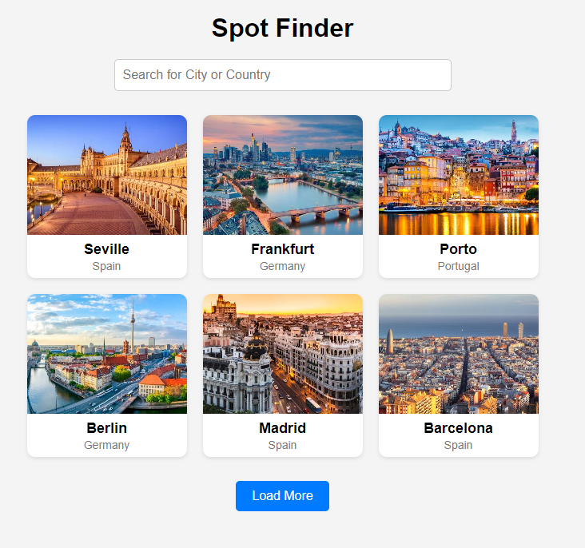
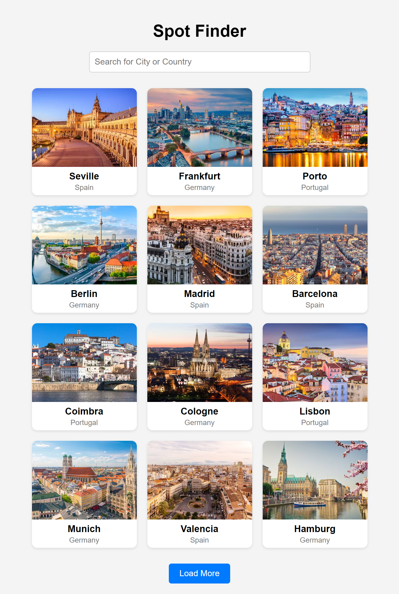
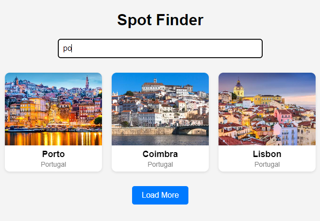

# Spot Finder App

The goal of the Spot Finder was to create an app that displays a list of city cards, each including an image, the city name, and the country. The app also features an input field to filter the cards based on the user's search query. At the bottom of the page, I added a button to load more cards, as I wanted only six cards to be displayed when the page initially loads.

One additional feature I'm planning to implement is replacing the load more button with a pagination system to enhance the user experience.

Below is an image showcasing the result of my Spot Finder app:

