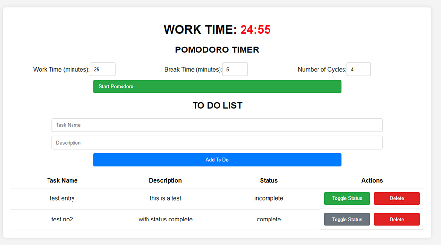

# To-Do-List

In this exercise, we were tasked with creating a to-do list that includes a form. When the form is submitted, it adds an entry to an existing table. Each table entry needed to have two buttons: one to change the status from incomplete to complete and another to delete the entry from the table.

Below is the result of my exercise. To further my understanding of the DOM, I decided to take an extra step and create a Pomodoro timer to manipulate more elements. The "WORK TIME" appears only after clicking the start Pomodoro button, in a similar way to how tasks are added to the table.

